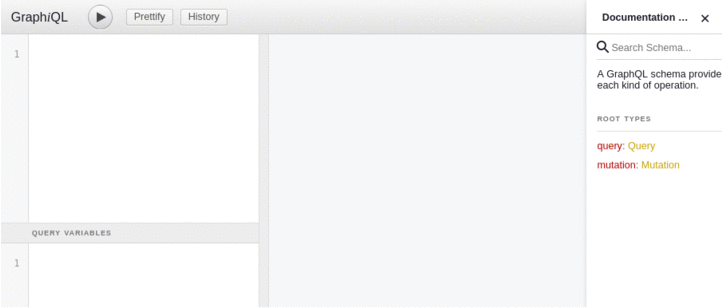

# example-kotlin-springboot-graphql

[](https://travis-ci.org/justiandre/example-kotlin-springboot-graphql) [](https://codecov.io/gh/justiandre/example-kotlin-springboot-graphql) [](https://codebeat.co/projects/github-com-justiandre-example-kotlin-springboot-graphql-master) [](https://sonarcloud.io/dashboard?id=justiandre_example-kotlin-springboot-graphql) [](https://sonarcloud.io/project/issues?id=justiandre_example-kotlin-springboot-graphql&resolved=false&types=BUG) [](https://sonarcloud.io/component_measures?id=justiandre_example-kotlin-springboot-graphql&metric=duplicated_lines_density) [](https://github.com/KotlinBy/awesome-kotlin) 


Projeto de exemplo com API GraphQL com dois crud’s simples, utilizando Kotlin, Spring Boot, Gradle etc.

## Tecnologias utilizadas
- [Kotlin](https://kotlinlang.org)
- [Spring Boot](https://projects.spring.io/spring-boot/)
- [Gradle](https://gradle.org)
- [Docker](https://www.docker.com)
- [GraphQL](https://graphql.org)
- [GraphQL Voyager](https://github.com/APIs-guru/graphql-voyager)
- [GraphQL GraphiQL](https://github.com/graphql/graphiql)
- [Spring Data](http://projects.spring.io/spring-data/)
- [Liquibase](https://www.liquibase.org)
- [H2 Database](http://www.h2database.com/html/main.html)
- [Jacoco](https://www.eclemma.org/jacoco/)


## Utilização e Build

Após a inicialização da aplicação, independente da forma, a mesma pode ser acessada ou ter a sua documentação acessada pelo link `http://localhost:PORTA_INICIADA/`.

**OBS:** Ao iniciar a aplicação, também é iniciado um banco de dados, H2 embutido, então não é necessário nenhuma dependência externa para a mesma ser iniciada e acessada.

### Links úteis 

Após o sistema ser iniciado podem ser acessadas as seguintes URLs.

#### [GraphQL](https://graphql.org) - [/graphql](http://localhost:8080/graphql)

URL para acesso a todos os recursos GraphQL da aplicação.

**URL:** `http://localhost:8080/graphql` ou `http://localhost:PORTA_INICIADA/graphql`.

#### [GraphQL/GraphIQL](https://github.com/graphql-java/graphql-spring-boot) - [/graphiql](http://localhost:8080/graphiql)

URL para acesso a uma IDE iterativa para operações GraphQL.

**URL:** `http://localhost:8080/graphiql` ou `http://localhost:PORTA_INICIADA/graphiql`.



#### [GraphIQL/Voyager](https://github.com/APIs-guru/graphql-voyager) - [/voyager](http://localhost:8080/voyager)

URL para acesso a um gráfico iterativa para operações GraphQL.

**URL:** `http://localhost:8080/voyager` ou `http://localhost:PORTA_INICIADA/voyager`.


#### [H2 Database](http://www.h2database.com/html/main.html) - [/h2-console](http://localhost:8080/h2-console)

URL para acesso a base de dados.

**URL:** `http://localhost:8080/h2-console` ou `http://localhost:PORTA_INICIADA/h2-console`.

**Dados de acesso**

* Setting Name: `Generic H2 (Embedded)`
* Driver Class:	`org.h2.Driver`
* JDBC URL: `jdbc:h2:mem:testdb`
* User Name: `sa`
* Password: `` (vazio)


### Utilização em ambiente local

Localmente o projeto pode ser configurado nas ide’s [IntelliJ](https://www.jetbrains.com/idea/) e [Eclipse](https://www.eclipse.org/ide/), ambas possuem suporte via plugin para Kotlin, Spring Boot e Gradle.

### Build usando artefatos locais (GIT)

**OBS:** Os arquivos e ferramentas de build, estão contidas dentro do projeto, então para execução do build, só é necessário ter o [Java](https://www.oracle.com/br/java/index.html) ou o Docker instalado. 

### Build local com Gradle

```shell
# Execução do build
./gradlew build
# Execução da aplicação
java -jar  build/libs/example-kotlin-springboot-graphql-0.0.1-SNAPSHOT
```

**OBS:** Com esses comandos a aplicação será iniciada, na porta 8080, mas isso pode ser alterado, informando o parâmetro: `-Dserver.port=$PORTA_DESEJADA`.

### Build local com Docker

```shell
# Execução do build
docker build -t app:latest .
# Execução da aplicação
docker run -d -p 8080:8080 app:latest
```

**OBS:** Com esses comandos a aplicação será iniciada, na porta 8080,  mas isso pode ser alterado, informando o parâmetro docker: `-p $PORTA_DESEJADA:8080`.

### Utilização com Docker (imagem remota do DockerHub)

```shell
# Execução da aplicação
docker run -d -p 8080:8080 justiandre/example-kotlin-springboot-graphql:master
```

**OBS:** Com esse comando a aplicação será iniciada, na porta 8080, mas isso pode ser alterado, informando o parâmetro docker: `-p $PORTA_DESEJADA:8080****************`.

## Arquivo e artefatos do projeto

| Arquivo ou diretório  |  Descrição |
| ------------ | ------------ |
| .travis.yml | Arquivo com as configurações de build contínuo, no caso desse projeto possui as configurações de build, testes e push da imagem Docker para o DockerHub | 
| Dockerfile | Arquivo com as configurações para criação da imagem Docker | 
| gradle/*, settings.gradle, gradlew.sh, gradlew.bat | Arquivos e diretórios de instalação do Gradle, com eles no projeto, não é necessário instalar o Gradle separadamente | 
| src/main/kotlin | Diretório com os fonts Kotlin da aplicação | 
| src/main/kotlin/tech/justi/example/kotlin/springboot/graphql/Application.kt | Classe responsável pela inicialização da aplicação | 
| src/main/kotlin/tech/justi/example/kotlin/springboot/graphql/domain/controller/graphql/config | Pacote com as classes com as configurações referentes ao graphql como tratamento de exceptions | 
| src/main/kotlin/tech/justi/example/kotlin/springboot/graphql/domain/controller/graphql/resolver | Pacote com as classes com os resolvers (endpoints) do graphql, tanto as de querys quanto as de mutação | 
| src/main/kotlin/tech/justi/example/kotlin/springboot/graphql/domain/entity | Pacote com as entidades de mapeamento JPA | 
| src/main/kotlin/tech/justi/example/kotlin/springboot/graphql/domain/repository | Pacote com as classes de acesso aos dados externos a aplicação | 
| src/main/kotlin/tech/justi/example/kotlin/springboot/graphql/domain/service | Pacote com as classes de regra de negocio do sistema | 
| src/main/kotlin/tech/justi/example/kotlin/springboot/graphql/infrastructure | O intuito desse pacote é manter as classes responsáveis pela infraestrutura da aplicação ou classes utilitárias, o fato é que esse pacote não deveria existir, o tal código visto aqui, deveria estar em componentes isolados fora da aplicação, podendo ser reaproveitado também em outras aplicações e fazendo um isolamento do codigo de negócio do codigo de infraestrutura ou utilitários. | 
| src/main/resources | Diretório com as configurações do sistema | 
| src/main/resources/application.yml | Arquivo de configuração do Spring Boot | 
| src/main/resources/banner.txt | Banner customizado do Spring Boot | 
| src/main/resources/db/changelog | Diretório com os arquivos de versionamento do banco de dados | 
| src/main/resources/graphql | Diretório com as configurações e mapeamento graphql | 
| src/test | Diretório com os fontes e configurações de teste |

## Log ao iniciar a aplicação.

```shell
+ + + + + + + + + + + + + + + + + + + + + + + + + + + + + + + + + + + + + + + +
+                          __             __                  __              +
+      __                 /\ \__  __     /\ \__              /\ \             +
+     /\_\  __  __    ____\ \ ,_\/\_\    \ \ ,_\    __    ___\ \ \___         +
+     \/\ \/\ \/\ \  /',__\\ \ \/\/\ \    \ \ \/  /'__`\ /'___\ \  _ `\       +
+      \ \ \ \ \_\ \/\__, `\\ \ \_\ \ \  __\ \ \_/\  __//\ \__/\ \ \ \ \      +
+      _\ \ \ \____/\/\____/ \ \__\\ \_\/\_\\ \__\ \____\ \____\\ \_\ \_\     +
+     /\ \_\ \/___/  \/___/   \/__/ \/_/\/_/ \/__/\/____/\/____/ \/_/\/_/     +
+     \ \____/                                                                +
+      \/___/                                                                 +
+                                                                             +
+   App de exemplo: Kotlin + Spring Boot + GraphQL                            +
+   https://github.com/justiandre/example-kotlin-springboot-graphql           +
+   Por: André Justi <justi.andre@gmail.com> - http://justi.tech              +
+                                                                             +
+ + + + + + + + + + + + + + + + + + + + + + + + + + + + + + + + + + + + + + + +


$datetime  INFO --- [           main] t.j.e.k.s.graphql.ApplicationKt          : Starting ApplicationKt on 108c4239b213 with PID 7 (/data/app.jar started by root in /data)
$datetime  INFO --- [           main] t.j.e.k.s.graphql.ApplicationKt          : The following profiles are active: default
$datetime  INFO --- [           main] ConfigServletWebServerApplicationContext : Refreshing org.springframework.boot.web.servlet.context.AnnotationConfigServletWebServerApplicationContext@32eebfca: startup date [Sun Sep 16 23:44:27 GMT 2018]; root of context hierarchy
$datetime  INFO --- [           main] trationDelegate$BeanPostProcessorChecker : Bean 'org.springframework.transaction.annotation.ProxyTransactionManagementConfiguration' of type [org.springframework.transaction.annotation.ProxyTransactionManagementConfiguration$$EnhancerBySpringCGLIB$$ace23b85] is not eligible for getting processed by all BeanPostProcessors (for example: not eligible for auto-proxying)
$datetime  INFO --- [           main] o.s.b.w.embedded.tomcat.TomcatWebServer  : Tomcat initialized with port(s): 8080 (http)
$datetime  INFO --- [           main] o.apache.catalina.core.StandardService   : Starting service [Tomcat]
$datetime  INFO --- [           main] org.apache.catalina.core.StandardEngine  : Starting Servlet Engine: Apache Tomcat/8.5.32
$datetime  INFO --- [ost-startStop-1] o.a.catalina.core.AprLifecycleListener   : The APR based Apache Tomcat Native library which allows optimal performance in production environments was not found on the java.library.path: [/usr/java/packages/lib/amd64:/usr/lib64:/lib64:/lib:/usr/lib]
$datetime  INFO --- [ost-startStop-1] o.a.c.c.C.[Tomcat].[localhost].[/]       : Initializing Spring embedded WebApplicationContext
$datetime  INFO --- [ost-startStop-1] o.s.web.context.ContextLoader            : Root WebApplicationContext: initialization completed in 2386 ms
$datetime  INFO --- [ost-startStop-1] com.zaxxer.hikari.HikariDataSource       : HikariPool-1 - Starting...
$datetime  INFO --- [ost-startStop-1] com.zaxxer.hikari.HikariDataSource       : HikariPool-1 - Start completed.
$datetime  INFO --- [ost-startStop-1] liquibase                                : Successfully acquired change log lock
$datetime  INFO --- [ost-startStop-1] liquibase                                : Creating database history table with name: PUBLIC.DATABASECHANGELOG
$datetime  INFO --- [ost-startStop-1] liquibase                                : Reading from PUBLIC.DATABASECHANGELOG
$datetime  INFO --- [ost-startStop-1] liquibase                                : classpath:/db/changelog/db.changelog-master.yaml: classpath:/db/changelog/db.changelog-master.yaml::1::andrejusti: Table Category created
$datetime  INFO --- [ost-startStop-1] liquibase                                : classpath:/db/changelog/db.changelog-master.yaml: classpath:/db/changelog/db.changelog-master.yaml::1::andrejusti: Table Product created
$datetime  INFO --- [ost-startStop-1] liquibase                                : classpath:/db/changelog/db.changelog-master.yaml: classpath:/db/changelog/db.changelog-master.yaml::1::andrejusti: Table Product_Category created
$datetime  INFO --- [ost-startStop-1] liquibase                                : classpath:/db/changelog/db.changelog-master.yaml: classpath:/db/changelog/db.changelog-master.yaml::1::andrejusti: ChangeSet classpath:/db/changelog/db.changelog-master.yaml::1::andrejusti ran successfully in 12ms
$datetime  INFO --- [ost-startStop-1] liquibase                                : Successfully released change log lock
$datetime  INFO --- [ost-startStop-1] j.LocalContainerEntityManagerFactoryBean : Building JPA container EntityManagerFactory for persistence unit 'default'
$datetime  INFO --- [ost-startStop-1] o.hibernate.jpa.internal.util.LogHelper  : HHH000204: Processing PersistenceUnitInfo [ name: default ]
$datetime  INFO --- [ost-startStop-1] org.hibernate.Version                    : HHH000412: Hibernate Core {5.2.17.Final}
$datetime  INFO --- [ost-startStop-1] org.hibernate.cfg.Environment            : HHH000206: hibernate.properties not found
$datetime  INFO --- [ost-startStop-1] o.hibernate.annotations.common.Version   : HCANN000001: Hibernate Commons Annotations {5.0.1.Final}
$datetime  INFO --- [ost-startStop-1] org.hibernate.dialect.Dialect            : HHH000400: Using dialect: org.hibernate.dialect.H2Dialect
$datetime  INFO --- [ost-startStop-1] j.LocalContainerEntityManagerFactoryBean : Initialized JPA EntityManagerFactory for persistence unit 'default'
$datetime  INFO --- [ost-startStop-1] o.s.b.w.servlet.ServletRegistrationBean  : Servlet dispatcherServlet mapped to [/]
$datetime  INFO --- [ost-startStop-1] o.s.b.w.servlet.ServletRegistrationBean  : Servlet simpleGraphQLServlet mapped to [/graphql/*]
$datetime  INFO --- [ost-startStop-1] o.s.b.w.servlet.ServletRegistrationBean  : Servlet webServlet mapped to [/h2-console/*]
$datetime  INFO --- [ost-startStop-1] o.s.b.w.servlet.FilterRegistrationBean   : Mapping filter: 'characterEncodingFilter' to: [/*]
$datetime  INFO --- [ost-startStop-1] o.s.b.w.servlet.FilterRegistrationBean   : Mapping filter: 'hiddenHttpMethodFilter' to: [/*]
$datetime  INFO --- [ost-startStop-1] o.s.b.w.servlet.FilterRegistrationBean   : Mapping filter: 'httpPutFormContentFilter' to: [/*]
$datetime  INFO --- [ost-startStop-1] o.s.b.w.servlet.FilterRegistrationBean   : Mapping filter: 'requestContextFilter' to: [/*]
$datetime  INFO --- [ost-startStop-1] o.s.b.w.servlet.FilterRegistrationBean   : Mapping filter: 'corsConfigurer' to: [/*]
$datetime  INFO --- [           main] o.s.w.s.handler.SimpleUrlHandlerMapping  : Mapped URL path [/**/favicon.ico] onto handler of type [class org.springframework.web.servlet.resource.ResourceHttpRequestHandler]
$datetime  INFO --- [           main] s.w.s.m.m.a.RequestMappingHandlerAdapter : Looking for @ControllerAdvice: org.springframework.boot.web.servlet.context.AnnotationConfigServletWebServerApplicationContext@32eebfca: startup date [Sun Sep 16 23:44:27 GMT 2018]; root of context hierarchy
$datetime  INFO --- [           main] s.w.s.m.m.a.RequestMappingHandlerMapping : Mapped "{[/error],produces=[text/html]}" onto public org.springframework.web.servlet.ModelAndView org.springframework.boot.autoconfigure.web.servlet.error.BasicErrorController.errorHtml(javax.servlet.http.HttpServletRequest,javax.servlet.http.HttpServletResponse)
$datetime  INFO --- [           main] s.w.s.m.m.a.RequestMappingHandlerMapping : Mapped "{[/error]}" onto public org.springframework.http.ResponseEntity<java.util.Map<java.lang.String, java.lang.Object>> org.springframework.boot.autoconfigure.web.servlet.error.BasicErrorController.error(javax.servlet.http.HttpServletRequest)
$datetime  INFO --- [           main] s.w.s.m.m.a.RequestMappingHandlerMapping : Mapped "{[/graphiql]}" onto public void com.oembedler.moon.graphiql.boot.GraphiQLController.graphiql(javax.servlet.http.HttpServletRequest,javax.servlet.http.HttpServletResponse,java.util.Map<java.lang.String, java.lang.String>) throws java.io.IOException
$datetime  INFO --- [           main] s.w.s.m.m.a.RequestMappingHandlerMapping : Mapped "{[/voyager]}" onto public void com.oembedler.moon.voyager.boot.VoyagerController.voyager(javax.servlet.http.HttpServletResponse) throws java.io.IOException
$datetime  INFO --- [           main] o.s.w.s.handler.SimpleUrlHandlerMapping  : Mapped URL path [/webjars/**] onto handler of type [class org.springframework.web.servlet.resource.ResourceHttpRequestHandler]
$datetime  INFO --- [           main] o.s.w.s.handler.SimpleUrlHandlerMapping  : Mapped URL path [/**] onto handler of type [class org.springframework.web.servlet.resource.ResourceHttpRequestHandler]
$datetime  INFO --- [           main] o.s.j.e.a.AnnotationMBeanExporter        : Registering beans for JMX exposure on startup
$datetime  INFO --- [           main] o.s.j.e.a.AnnotationMBeanExporter        : Bean with name 'dataSource' has been autodetected for JMX exposure
$datetime  INFO --- [           main] o.s.j.e.a.AnnotationMBeanExporter        : Located MBean 'dataSource': registering with JMX server as MBean [com.zaxxer.hikari:name=dataSource,type=HikariDataSource]
$datetime  INFO --- [           main] o.s.b.w.embedded.tomcat.TomcatWebServer  : Tomcat started on port(s): 8080 (http) with context path ''
$datetime  INFO --- [           main] t.j.e.k.s.graphql.ApplicationKt          : Started ApplicationKt in 11.396 seconds (JVM running for 12.04)
$datetime  INFO --- [nio-8080-exec-1] o.a.c.c.C.[Tomcat].[localhost].[/]       : Initializing Spring FrameworkServlet 'dispatcherServlet'
$datetime  INFO --- [nio-8080-exec-1] o.s.web.servlet.DispatcherServlet        : FrameworkServlet 'dispatcherServlet': initialization started
$datetime  INFO --- [nio-8080-exec-1] o.s.web.servlet.DispatcherServlet        : FrameworkServlet 'dispatcherServlet': initialization completed in 27 ms
```
